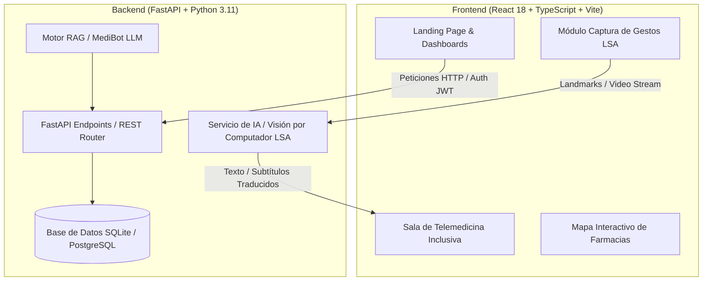

# 🏥 SUPER-UCE DOC — Plataforma de Telemedicina Inclusiva con IA Bidireccional (LSA)

[](https://github.com/SUPER-UCE-DOC/SUPER-UCE-DOC)
[](https://www.one.gob.do)
[](https://conadis.gob.do)
[](https://vitejs.dev/)
[](https://fastapi.tiangolo.com/)

**SUPER-UCE DOC** es una plataforma interdisciplinaria de telemedicina de código abierto concebida y desarrollada desde la **Universidad Central del Este (UCE)** en la República Dominicana. El proyecto integra inteligencia artificial, visión por computador, geolocalización de farmacias y expedientes clínicos digitales para eliminar las barreras de comunicación que enfrenta la comunidad sorda e hipoacúsica al acceder a servicios de salud.

---

## 📋 Tabla de Contenidos

- [1. Contexto & Problemática Académica](#1-contexto--problemática-académica)
- [2. Propuesta de Solución](#2-propuesta-de-solución)
- [3. Arquitectura del Sistema](#3-arquitectura-del-sistema)
- [4. Módulos y Funcionalidades por Rol](#4-módulos-y-funcionalidades-por-rol)
- [5. Guía de Instalación y Ejecución Local](#5-guía-de-instalación-y-ejecución-local)
- [6. Estándares y Cumplimiento Normativo](#6-estándares-y-cumplimiento-normativo)
- [7. Licencia y Créditos Académicos](#7-licencia-y-créditos-académicos)

---

## 🔬 1. Contexto & Problemática Académica

### 📊 Análisis Demográfico (República Dominicana)
De acuerdo con los datos oficiales del **X Censo Nacional de Población y Vivienda (2022)** realizado por la **Oficina Nacional de Estadística (ONE)** y los informes del **Consejo Nacional de Discapacidad (CONADIS)**:

- **Población con discapacidad:** En la República Dominicana viven **478,300+ personas** con algún tipo de discapacidad (representando el 4.8% de la población de 5 años y más).
- **Discapacidad auditiva:** Más de **100,000 personas** sufren de pérdida auditiva severa, moderada o sordera profunda.
- **Brecha de atención médica:** Menos del **5%** del personal médico y administrativo del sistema de salud dominicano cuenta con formación en lenguaje de señas, lo que genera:
  - ❌ **Errores de diagnóstico:** Imposibilidad de expresar síntomas complejos durante la anamnesis.
  - ❌ **Automedicación riesgosa y mala adherencia:** Incomprensión de posologías e indicaciones farmacológicas.
  - ❌ **Violación del derecho a la privacidad:** Dependencia continua de terceros o familiares para interpretar consultas íntimas.

### ⚖️ Marco Legal (Ley 43-23)
En la República Dominicana se promulgó la **Ley No. 43-23**, que regula el uso de la **Lengua de Señas** en el país (adaptada al Lenguaje de Señas Americano - LSA) y establece la obligatoriedad de garantizar accesibilidad en servicios públicos esenciales como la salud. **SUPER-UCE DOC** responde a esta exigencia legal y humana mediante tecnología accesible e inclusiva.

---

## 🚀 2. Propuesta de Solución: SUPER-UCE DOC

SUPER-UCE DOC unifica a pacientes, médicos y farmacias dentro de un solo ecosistema digital sin fisuras:

1. **Traducción IA Bidireccional en Tiempo Real (LSA):**
   - Módulos de visión artificial que capturan la gesticulación del paciente sordo en **Lenguaje de Señas Americano (LSA)** a través de la webcam.
   - Traducción instantánea de señas clínicas a texto y voz para el médico, así como subtitulado en pantalla y transcripción automática de la voz del médico a texto para el paciente.

2. **Teleconsultas Integradas (100% In-Platform):**
   - Videollamadas en vivo de alta calidad directamente dentro de la plataforma (sin requerir enlaces a Zoom, Google Meet o WhatsApp).
   - Asistente clínico inteligente (MediBot RAG) integrado para resolver dudas médicas generales pre-consulta.

3. **Geolocalización de Farmacias & Despacho Digital de Recetas:**
   - Emisión de recetas electrónicas firmadas digitalmente por el médico.
   - Mapa interactivo con geolocalización que identifica farmacias cercanas en el territorio dominicano, verificando la disponibilidad inmediata de medicamentos.

---

## 🏗️ 3. Arquitectura del Sistema



### Stack Tecnológico
- **Frontend:** React 18, TypeScript, Tailwind CSS, Vite, Lucide React, Leaflet Maps.
- **Backend:** Python 3.11, FastAPI, Pydantic, SQLAlchemy.
- **Inteligencia Artificial:** MediaPipe (Tracking Holístico / Manos), Clasificadores de Señas Clínicas LSA, Motor RAG (Retrieval-Augmented Generation) para asistencia médica.
- **Despliegue:** Vercel (Frontend Web App), Uvicorn/Docker (Backend Services).

---

## 👥 4. Módulos y Funcionalidades por Rol

| Módulo / Rol | Funcionalidades Clave |
| :--- | :--- |
| 🧑‍🦻 **Paciente** | • Teleconsultas en vivo con traducción LSA en tiempo real.<br>• Historial médico digital y recetas asignadas.<br>• Geolocalización de farmacias cercanas con medicamentos en stock. |
| 👨‍⚕️ **Médico** | • Dashboard de gestión de citas y teleconsultas en curso.<br>• Transcripción bidireccional voz ↔ LSA activada en vivo.<br>• Emisión de recetas digitales vinculadas al expediente del paciente. |
| 🏥 **Farmacia** | • Panel de recepción y validación de recetas digitales.<br>• Actualización en tiempo real del inventario de medicamentos.<br>• Confirmación de despacho y ubicación en mapa interactivo. |

---

## 🛠️ 5. Guía de Instalación y Ejecución Local

### Prerrequisitos
- **Node.js**: v18.0 o superior
- **Python**: v3.10 o superior
- **Git**

### 1️⃣ Clonar el Repositorio
```bash
git clone https://github.com/SUPER-UCE-DOC/SUPER-UCE-DOC.git
cd SUPER-UCE-DOC
```

### 2️⃣ Configurar y Ejecutar el Frontend
```bash
cd FrontEnd
npm install
npm run dev
```
> El servidor local del Frontend iniciará en `http://localhost:5173`.

### 3️⃣ Configurar y Ejecutar el Backend
```bash
cd ../BackEnd
python -m venv venv
source venv/bin/activate  # En Windows: venv\Scripts\activate
pip install -r requirements.txt
uvicorn app.main:app --reload --port 8000
```
> La API REST estará disponible en `http://localhost:8000` y la documentación Swagger en `http://localhost:8000/docs`.

---

## 🛡️ 6. Estándares y Cumplimiento Normativo

- **WCAG 2.1 AA:** Diseño de interfaz bajo pautas internacionales de accesibilidad web (contraste adaptado, navegación por teclado, soporte de lectores de pantalla).
- **Ley 43-23 (RD):** Cumplimiento con las regulaciones de la República Dominicana sobre inclusión de Lengua de Señas en servicios esenciales.
- **HIPAA / HL7 FHIR:** Estructuración del historial clínico y privacidad de datos médicos respetando estándares internacionales de confidencialidad médica.

---

## 🎓 7. Licencia y Créditos Académicos

Desarrollado como iniciativa académica de código abierto en la **Universidad Central del Este (UCE)**, República Dominicana.

- **Licencia:** MIT / Open Source.
- **Institución:** Universidad Central del Este (UCE).
- **Año:** 2026.
